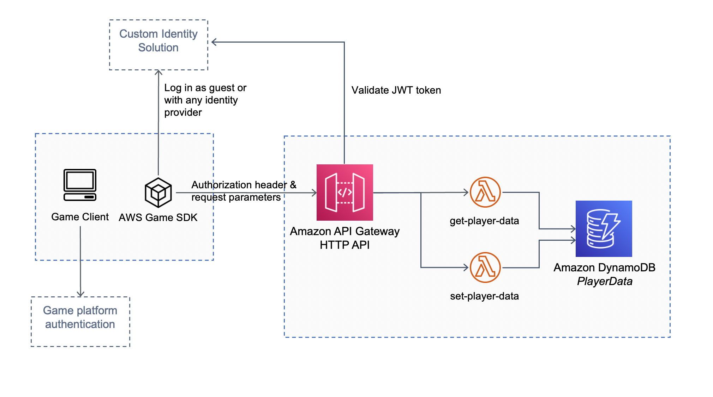
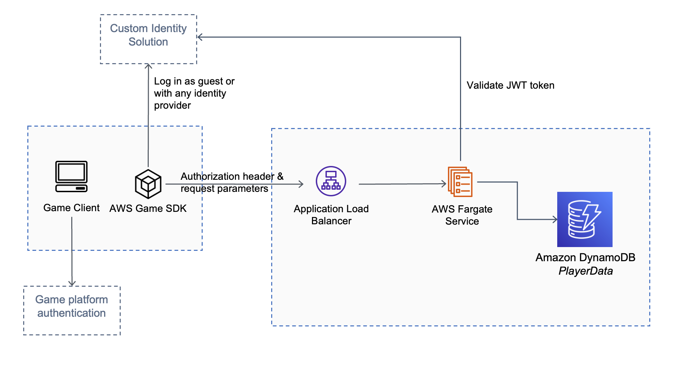

# AWS Game Backend Framework Sample Backend Components

These sample components can be deployed to test integration from a game client to a backend using the authentication feature of the custom identity component.

**Logs and Distributed Tracing**

All the backend template components leverage **AWS X-Ray** for distributed tracing, as well as **AWS CloudWatch** for logs. You can find both the logs and the tracing map and individual trace information the **AWS CloudWatch** console.

# Serverless REST API sample component template

It is recommended to deploy the serverless API Gateway HTTP API backed component template next to test out your integration from a game engine. The templates work as starting points for your own backend development. We'll deploy the `PythonServerlessHttpApiStack` that can be found in `BackendComponentSamples`.

To deploy the component, run the following commands
1. `cd ..` to return to the root and `cd BackendComponentSamples` to navigate to samples
2. `npm install` to install CDK app dependencies
4. `cdk synth` to synthesize the CDK app and validate your configuration works
5. `cdk deploy PythonServerlessHttpApiStack` to deploy the CDK app to your account

You'll see a new stack deployed in the AWS CloudFormation console, with an API Gateway HTTP API to set and get player data, backed up with Python Lambda functions and an Amazon DynamoDB PlayerData table.

## Architecture

# Loadbalanced AWS Fargate sample component template

Another option is to deploy the AWS Fargate sample component that deploys an AWS Fargate service with an Application Load Balancer, and use Node.js on the server side. It leverages the [aws-verify-jwt package](https://github.com/awslabs/aws-jwt-verify) to verify the JWT tokens received from the backend, and sets and gets player data in a DynamoDB table in the same way as the Serverless sample component. You can optionally use this Fargate component as your test integration point within the game engines

To deploy the component, run the following commands
1. Make sure you have __Docker running__ before you open the terminal, as the deployment process creates a Docker image
2. `cd ..` to return to the root and `cd BackendComponentSamples` to navigate to samples
3. `npm install` to install CDK app dependencies
4. `cdk synth` to synthesize the CDK app and validate your configuration works
5. `cdk deploy NodeJsFargateApiStack` to deploy the CDK app to your account

## Architecture

